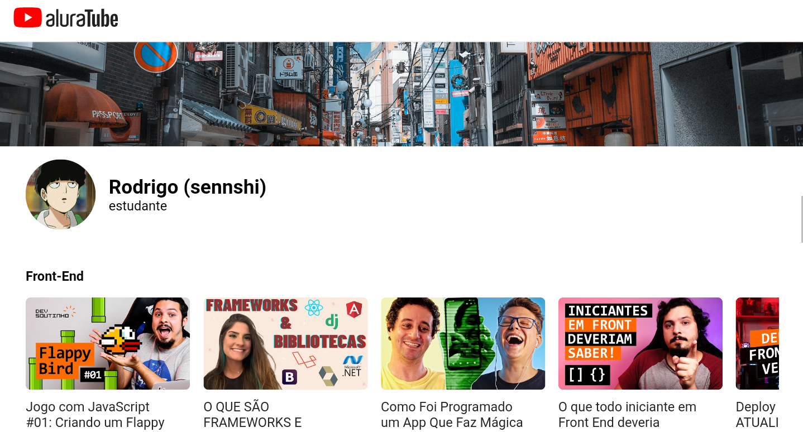

# AluraTube




> O projeto é um clone do YouTube que está sendo feito/desenvolvido ao decorrer da Imersão React 5

Estão sendo usadas as seguintes tecnologias no projeto:
* ReactJs
* NextJs
* Styled Components

## 💻 Pré-requisitos
Para executar o projeto é necessário:
* Ter o `nodejs` instalado
* Instalar as dependências necessárias:
  ```
  $ npm install next react react-dom
  ```

## 🚀 Testando o projeto localmente

Para testar o projeto, clone esse repositório utilizando:
```
git clone https://github.com/sennshi/aluratube
```
Após clonar o repositório, execute o seguinte comando para instalar as dependências necessárias;
```
npm i
```
E execute `npm run dev ` ou `npm run start` para iniciar o projeto, após isso acesse `localhost:3000`
